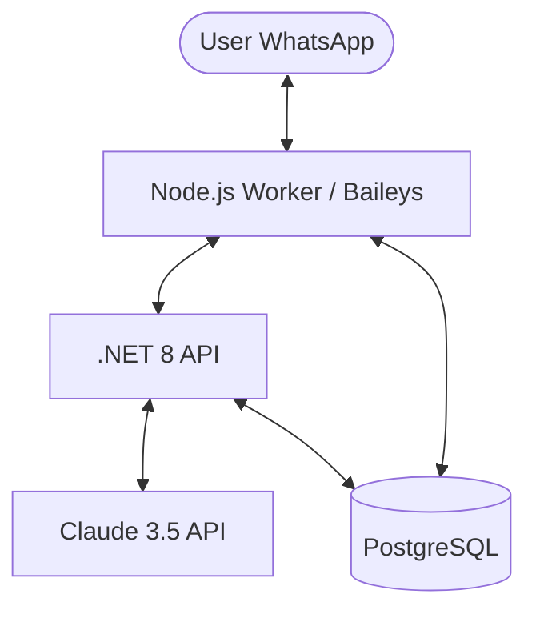

# Olubanise Implementation Plan (Antigravity Edition)

This document outlines the architectural strategy and step-by-step implementation for **Olubanise**, a multi-tenant AI personal assistant SaaS.

## 1. Project Overview
- **Objective**: 24/7 WhatsApp agent powered by Claude 3.5.
- **Model**: Managed Proxy (Users pay "Logic Credits").
- **Core Stack**: 
  - .NET 8 (Orchestrator)
  - Node.js + Baileys (Worker)
  - PostgreSQL (Database)
  - Docker (Containerization)

## 2. Architecture Diagram (Conceptual)

## 3. Detailed Implementation Phases

### Phase 1: Research & Schema (Complete)
- [x] Research Baileys multi-session management.
- [x] Design PostgreSQL schema (`Users`, `Wallets`, `WhatsAppSessions`, `TransactionLogs`).
- [x] Initialize Git repository structure.

### Phase 2: .NET Orchestrator (Backend) - Mostly Complete
- [x] Framework: .NET 8 Web API.
- [x] Intelligence Proxy:
  - `POST /api/intelligence/chat`: 
    - Validates User ID and logic credits.
    - Forwards request to Anthropic Claude 3.5.
    - Calculates token costs (Input + Output).
    - Deducts credits from `Wallets`.
- [x] Billing Service (Implicit in DB & Controller).
- [x] Session Management: Endpoints implemented in `SessionsController`.
- [ ] SignalR: Implement `OlubaniseHub` for future desktop/web real-time updates.

### Phase 3: The Refactored Worker (Node.js) - Mostly Complete
- [x] Base: Refactor `moltbot` (Baileys-based).
- [x] Multi-Tenancy: 
  - `WASessionManager`: Tracks `Map<UserId, WASocket>`.
  - Dynamically spawn/kill sessions based on user login.
- [x] RemoteAuth Module:
  - `Thaw`: Retrieve session blob from PG.
  - `Freeze`: Listen to `creds.update` -> Upload to PG.
- [x] Intelligence Bridge: Replace local LLM logic with HTTP calls to the .NET Orchestrator.

### Phase 4: Docker & Verification
- **Docker Compose**:
  - Service `db`: Postgres 15.
  - Service `orchestrator`: .NET 8 API.
  - Service `worker`: Node.js Baileys service.
- **Smoke Test**:
  - Spin up all containers.
  - Register a test user.
  - Launch a WhatsApp session via Worker.
  - Send a message and verify credit deduction in Orchestrator logs.

## 4. Key Security & Performance Considerations
- **Managed Proxy**: The Claude API key never touches the client/worker. It stays in the .NET Orchestrator.
- **Memory Efficiency**: Using Baileys (Socket) instead of Puppeteer keeps RAM usage ~30MB per session.
- **Transaction Integrity**: Use DB transactions for credit deductions to prevent "double-spend" of logic credits.

---
**Next Step**: Phase 4 (Docker & Verification). We will spin up the environment, seed a test user, and verify the end-to-end multi-tenant flow.
